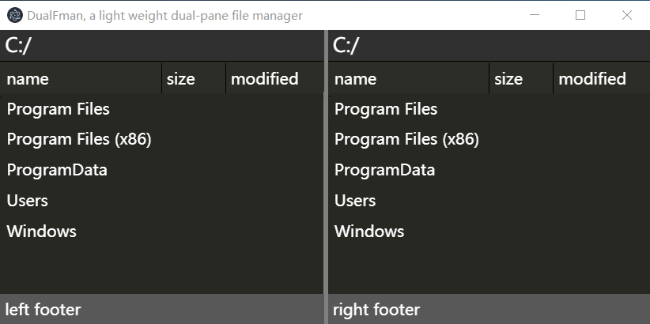

#fman 
---------------------------------------

---------------------------------------
fman is a electron based two-pane file manager.
This project learn from dual-pane filemanager by [Michael Herrmann](https://fman.io/).

##Feature
* Press Ctrl+P to quickly jump to a directory.
* Press Ctrl+Shift+P jump to Command Palette.
